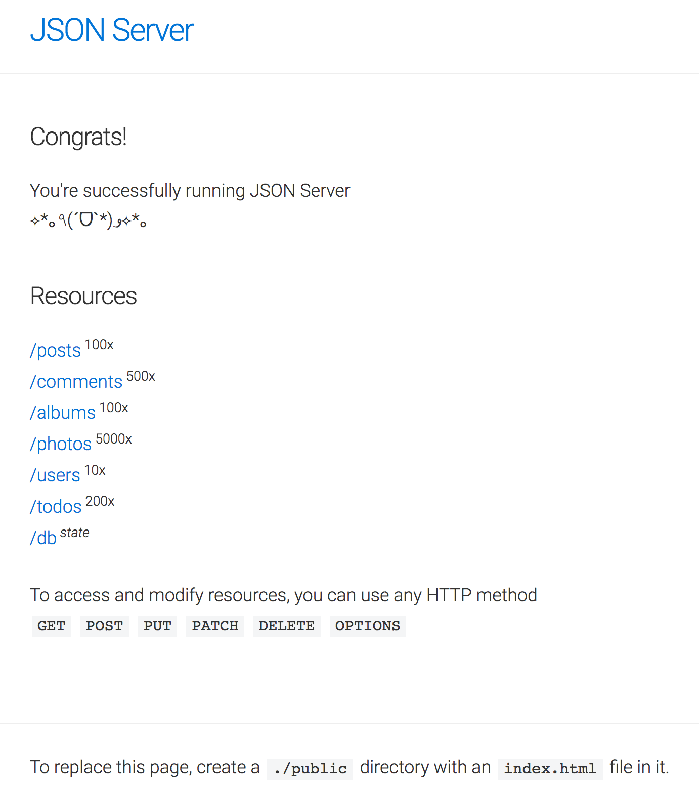

# [Create a Fake REST API with JSON-Server](https://www.youtube.com/watch?v=1zkgdLZEdwM)

In this tutorial, we will learn how to install a fake API using an incredible tool called JSON-Server. This can be used for mocking and prototyping. It is useful to anyone building frontend apps with something like Angular, React, etc.

### Resources
- [JSON-Server Github page](https://github.com/typicode/json-server)
- [Postman app](http://www.getpostman.com/)

